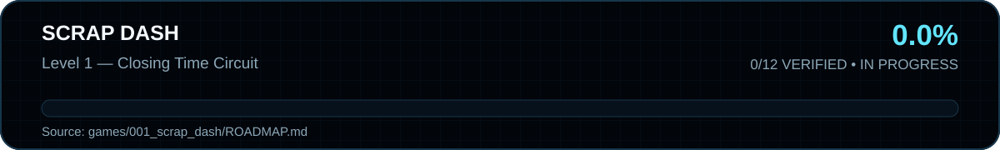

<!-- SWIR-README-STANDARD:v2 -->

# SCRAP DASH

<div align="center">


</div>

**SCRAP DASH** is an original fast 2D/2.5D Unity platformer about a tiny salvage robot escaping a broken amusement park after closing time.

The first playable level is **Closing Time Circuit**. The source currently targets Unity 6.3 LTS and uses the Unity Input System for keyboard and gamepad controls.

## Level 1 progress



**Verified progress:** 0/12 = 0.0%. Runtime verification is pending a successful Unity CI activation.

## Current gameplay

- run with acceleration and air control;
- variable jump, coyote time and jump buffering;
- horizontal dash;
- rail-aligned runaway-cart platform with a pulsing beacon, measurable route progress and safe endpoint pauses;
- self-centering Magnet Lift that visibly energizes while carrying the player;
- pulsing electric hazards, fatal-impact feedback and safe checkpoint/fall recovery;
- a warning-eye patrol enemy that accelerates into a short-range charge;
- stomp attack that recycles the patrol enemy and bounces the player;
- five animated cyan-core scrap pieces with persistent per-run collection and exit-ready HUD feedback;
- a salvage spring launch into a visibly energized Magnet Lift section;
- moving-platform velocity carry for reliable keyboard and gamepad traversal;
- velocity-aware camera look-ahead, bounded framing and instant respawn recentering;
- pulsing cyan/yellow route chevrons for gaps, the cart, Magnet Lift and finish;
- original procedural sound effects, collectible/stomp/checkpoint sparks and a cyan dash trail;
- finish gate with a minimum scrap objective;
- run timer, death counter, persistent best time and end-of-level grade;
- HUD, pause, restart, fullscreen/windowed toggle, resolution presets and persistent master volume.

## Controls

| Action | Keyboard | Gamepad |
|---|---|---|
| Move | A/D or arrows | Left stick / D-pad |
| Jump | Space/W/Up | South button / A |
| Dash | Left Shift/X | East button / B |
| Pause | Esc | Start |
| Restart | R | Back/View |
| Fullscreen | F11 | Left stick click |
| Resolution | F10 | Right stick click |
| Volume | [ / ] | LB / RB |

## Open in Unity

Open this directory as its own Unity project:

```text
games/001_scrap_dash/
```

Pinned editor line: **Unity 6000.3.13f1 (Unity 6.3 LTS)**. The repository also commits deterministic Unity 6.3 player settings for the new Input System, a resizable 1920x1080 Windows window and borderless fullscreen switching.

## Demo status

A Windows demo is **not yet published**. It becomes downloadable only after Unity EditMode/PlayMode tests and the Windows x64 CI build pass on the exact project revision.

The PlayMode evidence suite drives real Input System keyboard/gamepad devices and physical Level 1 triggers for run, variable jump, coyote time, jump buffering, full dash bursts, air-dash recharge, dash attacks, recovery-grace damage and core-failure respawn, pause/restart, scrap collection, checkpoint recovery, hazards, the moving cart, Magnet Lift and a complete locked-gate-to-win loop.

## Roadmap

See [ROADMAP.md](ROADMAP.md). The roadmap counts verified gameplay/runtime deliverables only.

## Legal

SCRAP DASH is an original project. Its robot icon, procedural programmer art, generated sound effects, code, names and world were created specifically for this game. It does not contain Tiny Toon, ROM-derived content, Warner Bros. assets, or other ripped commercial game materials.

## 🔎 Search Keywords

`SCRAP DASH game` • `Unity 2D platformer` • `Unity 6 platformer` • `Windows platformer game` • `gamepad platformer` • `dash platformer` • `robot platformer` • `indie amusement park game` • `Unity Input System game` • `original 2D game`

<div align="center">

### `RUN • JUMP • DASH • ESCAPE`

[**← Games2D**](../../README.md) · [**SWIR profile →**](https://github.com/Swir)

</div>
